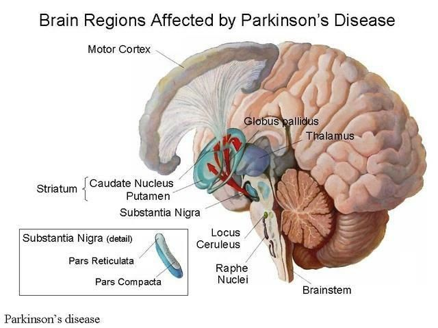
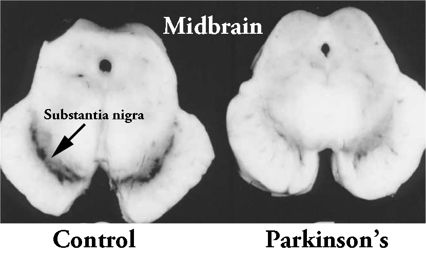

\renewcommand\thesubsection{\Roman{subsection}}
\renewcommand\thesubsubsection{\Alph{subsubsection}}

\newpage
\tableofcontents
\newpage

```{r load_libraries, include=FALSE}
if(!require(dplyr)) install.packages("dplyr", repos = "http://cran.us.r-project.org")
if(!require(ids)) install.packages("ids", repos = "http://cran.us.r-project.org")
if(!require(tidyr)) install.packages("tidyr", repos = "http://cran.us.r-project.org")
if(!require(caret)) install.packages("caret", repos = "http://cran.us.r-project.org")
if(!require(anytime)) install.packages("anytime", repos = "http://cran.us.r-project.org")
if(!require(ggplot2)) install.packages("ggplot2", repos = "http://cran.us.r-project.org")
if(!require(geiger)) install.packages("geiger", repos = "http://cran.us.r-project.org")
if(!require(ggpubr)) install.packages("ggpubr", repos = "http://cran.us.r-project.org")
if(!require(lubridate)) install.packages("lubridate", repos = "http://cran.us.r-project.org")
```


# Introduction

This report presents the analysis and results of the "Choose Your Own Project" from the HarvardX's ninth course of the Data Science Professional Certificate Program available on edx.org. The chosen thematic is the prediction of the Parkinson's disease diagnosis depending on the results of three tests, measuring the motor performance, the tremor and the hand stability.

## Nota bene

The terms anotated with an asterisk are explained or more detailled in the glossary at the end of the report.

The following section is a quick presentation of the Parkinson's disease but is not mandatory to understand this report.

When not relevant, the code used to create this report is run but not displayed. The complete source code can be found on GitHub (https://github.com/ncaparros/ParkinsonDisease_SpiralDrawing).

## Parkinson's disease

Parkinson's disease, sometimes abreviated to PD, is a long-term neurodegenerative disorder. Its cause is unknown, though it is believed to involve genetic (as relatives tend to contract the disease), and/or environmental factors (as pesticides). 

The disease affects mostly the motor system, as tremor, akinesia*, shaking, rigidity, slowness of movement, difficulty with walking,... and as it worsen it can cause depression, anxiety (more than a third of people with Parkinson's disease), emotional and sleep troubles, and in the advanced stages the disease can lead to dementia.

The motor symptoms of the Parkinson's disease (parkinsonian syndrome) are caused by the death of cells, more precisely dopaminergic* neurons, in the *substantia nigra* * (a region of the midbrain, see Figure 2). The *substantia nigra* is a basal ganglia* divided into to parts : the *pars reticula* * and the *pars compacta** (see Figure 1). It is the part of the brain that plays an important role in reward-seeking, learning and movement. 

Dopamine is an organic chemical functioning as both an hormone and a neurotransmitter. Basically, neurotransmitters are chemical messengers which transmit signals by being released from one neuron to a receptor on the target cells. Neurotransmitters are critical to execute everyday functions as, in our case, movement (contact between a motor neuron  and a muscle fiber).

The lack of dopamine (due to the death of those cells, and therefore induces a smaller substancia nigra than on a healthy subject, see Figure 2) provokes emotional troubles as said previously, and since the downsized *substancia nigra* is connected to the motor cortex (via the *pars reticula*, see Figure 1), it causes the parkisonian syndromes.

The Figure 1 shows a lateral cross-section of a brain. The red arrows represent the dopamine's exchanges between the *pars reticula*. The Figure 2 shows the lack of dopaminergic neurons in a brain of a person affected by Parkinson's disease compared to a healthy brain.





Parkinson's disease affected 6.2 million people in 2015 and resulted in more than 117,000 deaths. This condition mostly occurs in people over the age of 60 (about one percent are affected). The average life expectancy following diagnosis is between 7 and 15 years.

## Project overview

In 2011, the Department of Neurology in Cerrahpasa Faculty of Medicine in Istanbul University (Turkey) provided a data set  of test results from 62 patients with the Parkinson's disease and 15 from healthy people for a study (Muhammed Erdem Isenkul, Betul Erdogdu Sakar and Olcay Kursun) which purpose was to monitor Parkinson's disease with digitized graphics tablet. The goal of this study was to provide easy access to Parkinson's disease progress monitoring to the elderly patients, or patients with an advanced stage of the disease, instead of the inconvenient and time-consuming process at the clinic. The tests aim to be non-invasive, would not require brain scans, would ease the work of the medical doctors, and would not require trained medical staff assigned to this task.

### Material

It was decided to perform three handwriting tests on a graphic tablet (Wacom Cintiq 12WX graphics, see Figure 3). The tablet would measure several parameters as : the coordinates (x-y-z) of the pen on the table, the pressure over the screen, the grip angle on the pen at regular time intervals. A software was developped in order to test the coordination of the patient.


### Tests 

The three tests performed by the patients were :

* **Static Spiral Test (SST)** is a traditionnal test usually performed with paper and pencil. An Archimedean spiral (see following plot) is printed on it, and the patient needs to retrace it. The more the patient suffer from an advanced stage of the Parkinson's disease, the more differences between the archimedean spiral and his drawing.

* **Dynamic Spiral Test (DST)** is a new test introduced in the study, where the archimedean spiral *blinks*. It is only seen at certain times. It becomes more difficult to follow the spiral.

* **Stability Test on Certain Point** is a test where there is a red point in the middle of the tablet's screen, and the patients are asked to hold the pen on the point without touching the screen. This test determine the patient's hand stability and hand tremor level.

### Archimedean spiral

```{r archimedean spiral, echo=FALSE, fig.align="center", fig.width=6, fig.height=6, fig.cap="Archimedean spiral"}
 b <- 11.5
 t <- seq(0,6*pi, length.out=500)
 x <- b*t * (cos(t))
 y <- b*t * - (sin(t))
 archimedeanSpiral = data.frame(x,y)
 ggplot() + geom_path(aes(x,y), color="red")
```

### Goal 

In this report I will try to build an algorithm able to predict if the patient has or has not Parkinson's disease based on this dataset. I do not have access to the software used in the study, so I will have to recreate and approximate the Archimedean spiral. I do not have access to the *scores* of the patients, given by neurologists, representing the stage of Parkinson's disease. Therefore, my output will only be a boolean, has, or has not, with a percentage of probability. Not a neurological scale. If efficient, these results would help determine if a person taking the test should consult a specialist for further examination. 

## Dataset overview

The dataset provided was an archive .zip containing three folders. One of them was composed by only .png images of the tests results, which were already saved in the text dataset. In the two remaining folders, there were datasets related to healthy (called controls) and people with Parkinson's disease (called PWP, People With Parkinson). Since the datasets in both folders were following the same pattern, they were merged in a single one.

Each text file of the dataset was the test results of a single patient. Each line of the file represented one measure, at a certain time, of the X-Y-Z coordinates of the digital pen, the pressure of the pen on the screen, the grip angle, the timestamp (at which the measure had been taken) and the test identifier (Static Spiral Test : 0, Dynamic Spiral Test : 1, Stability Test on Certain Point :2).

```{r extracting datas and building data frame, include=FALSE}
createDf <- function(){
  
  #File path to the directory containing the datas of the healthy people (controls)
  filePathCtrl = "data/hw_dataset/control/"
  
  #Getting the name of all the files in the directory in order to load the datas
  fileNamesCtrl <- list.files(path = filePathCtrl)
  
  #Reading the data for all the control files
  controls <- do.call(rbind, lapply(fileNamesCtrl, function(x) {
    
    #generate a random id for the patient
    randID <- proquint_to_int(proquint(), as = "numeric")
    
    #add id and isPwp as column
    t <- cbind(read.table( file = paste(filePathCtrl,
                                        x, 
                                        sep="")), 
               patientID = randID, 
               isPwp = FALSE)
  }))
  
  #File path to the directory containing the datas of the people with Parkinson (PWP)
  filePathPwp = "data/hw_dataset/parkinson/"
  
  #Getting the name of all the files in the directory in order to load the datas
  fileNamesPwp <- list.files(path = filePathPwp)
  
  #Reading the data for all the Parkinson files
  pwp <- do.call(rbind, lapply(fileNamesPwp, function(x) {
    
    #generate a random id for the patient
    randID <- proquint_to_int(proquint(), as = "numeric")
    
    #add id and isPwp as column
    t <- cbind(read.table( file = paste(filePathPwp,
                                        x, 
                                        sep="")), 
               patientID = randID, 
               isPwp = TRUE)
  }))
  
  #merge controls and pwp df into a single data.frame
  df <- rbind(controls, pwp)
  
  return(df)
}


if(dir.exists("data")){
  #First case : the data already exists on the working directory

  df <- createDf()
  
}else{
    #Second case : the data does not exist on the working directory
    
    #Names for : the created temporary directory, the directory we need to move, main the directory
    dirpath = "data"
    dirToMove = "new_dataset/parkinson"
    dirToKeep = "hw_dataset/parkinson"
    
    #download the .zip containing the datasets from UCI
    dl <- tempfile()
    download.file("https://archive.ics.uci.edu/ml/machine-learning-databases/00395/PARKINSON_HW.zip", dl)
    
    #unziping the archive
    unzip(dl, exdir="data")
    
    #Copy the files from the new_dataset/parkinson into the main directory hw_dataset/parkinson
    sapply(c(list.files(paste0(dirpath,"/",dirToMove))), function(file){
      file.copy(paste0(dirpath,"/",dirToMove,"/",file), dirToKeep)
    })
    
    #building the data frame
    df <- createDf()
    
    #Removing the temporary directory
    unlink(dirpath, recursive = TRUE)
}

```


The data was presented as *X;Y;Z;Pressure;GripAngle;Timestamp;TestID*:

>191;205;0;39;1350;17535179;0

>191;205;0;54;1360;17535186;0

>191;205;0;60;1350;17535193;0

>191;205;0;61;1360;17535200;0

# Method and analysis

In this section I described the process, from analysing the original dataset, to building the prediction algorithms, through data cleaning and analysis.

## Initial Data

Once the data downloaded and the data frame built (see previous section), the first step was to add a random identifier to each patient and to note if he has Parkinson's disease or not. The random identifier had been chosen because :
* since the text files were from different folders, and as some files had the same numbers, no pattern could be used for identifiers.
* it allowed to not get focused on the patient id.

```{r patientID and isPWP, echo=FALSE}
head(df)
```

Then, each value had to be extracted into a new column of the data frame.

```{r extracting data, echo=FALSE}
df <- df %>% separate(V1, c("X", "Y", "Z", "Pressure", "GripAngle","Timestamp", "TestID"),";")
head(df)
```

X and Y represents the place of the pen on the tablet, we can assume horizontally and vertically, and Z is the height between the pen and the screen. A Z equal to 0 means the pen is on the screen.

A new data frame containing one line by patient was then created and filled as :

```{r extracting patients, echo=FALSE}
patients <- df %>% select(patientID, isPwp) %>% distinct(patientID, isPwp)
head(patients)
```
It will be used for summaries and additionnal informations on the patient or the test later.

## Data cleaning

In this subsection I explained the process of formating the values, cleaning the Timestamp column and calibrating the test samples.

### Format

Since the datas were extracted from a text file, they were all, but the two we added, of class character.

```{r column classes}
lapply(df,class)
```

It was impossible then to perform any action on those values, so they were all converted as numeric.

```{r text values as numeric}
df <- df %>% mutate(X = as.numeric(X),
                    Y = as.numeric(Y),
                    Z = as.numeric(Z),
                    Pressure = as.numeric(Pressure),
                    GripAngle = as.numeric(GripAngle),
                    Timestamp = as.numeric(Timestamp))
```

### Cleaning TimeStamp

The timestamp columns seemed pretty obscur, and trying to parse it into a readable date would do produce either an impossible date (`make_date` or  `make_datetime`) or NA values (`dym`, `mdy_hms`, `as.Date`,...).

```{r trying to parse timestamp}
make_date(as.character(df[1,]$Timestamp))
make_datetime(df[1,]$Timestamp)
dym(as.character(df[1,]$Timestamp))
as.Date(as.character(df[1,]$Timestamp), "%Y%M%D")
```

To be able to use the timestamp more easily, and mostly because we do not know its unit (probably milliseconds but we cannot know for sure), I substracted the first timestamp of every couple test/patient to all the timestamp values, making the first value 0. To do this I had to create a new empty data frame, and two for loops : one for the test (0 to 2) and one for the patients (0 to `nrow(patients)`). Inside the loops, I would get the values of the current patient for the current test, arranged by ascending timestamp, and the first value would be the initial timestamp value. Then, every timestamp would be mutated as $timestamp_i = timestamp_i - timestamp_0$. The mutated data frame would then be merge (`rbind`) into the final data frame.

```{r cleaning timestamp}
head(df)

completeDf <- data.frame()

#For each of the tests "test"
for(test in seq(0, by=1, length=3)){
  
  #For each of the patients "indPatient"
  for(indPatient in seq(1, by=1, length=nrow(patients))){
    
    #Create a temporary data frame for patient "indPatient" 
    #and test "test"
    temp_df <- df %>% 
      filter(TestID == test & 
               patientID == patients[indPatient,]$patientID) %>% 
      arrange(Timestamp)
    
    #Get first value of timestamp
    initialTimestamp = temp_df[1,]$Timestamp
    
    #Mutate Timestamp so that the very first value of Timestamp 
    #for patient "indPatient" and test "test" is equal to 0
    temp_df <- temp_df %>%
      mutate(Timestamp = Timestamp - initialTimestamp)
    
    #Bind temporary data frame to complete data frame
    completeDf <- rbind(completeDf, temp_df)
    
    
  }
}

head(completeDf)
```

With this modification, it was easier to compare the timestamps between patients and tests, since now the first value of every test by a patient was 0.

### Calibrating the samples

A quick look at the test results (the drawings) showed that the samples were not all consistent in term of X-Y ratio (see Plot). Seven samples can be seen with a X-Y ratio of almost 2 instead of 1. With the Archimead spiral formula in mind, it seemed odd that a small part of the patients would have been given a different test with a different drawing to follow. 

```{r ploting X-Y for Test0}
completeDf %>% 
  filter(TestID == 0) %>% 
  ggplot() +
  geom_point(aes(X,Y, color=patientID), 
             show.legend = FALSE) + 
  ggtitle("Samples for Test 0")
```

Another odd detail was a spacial gap between patterns with the same ratio (see Plot). One of the control sample seemed to have been shifted.

```{r ploting X-Y for Test0 and controls}
completeDf %>% 
  filter(TestID == 0 & 
           isPwp == FALSE) %>% 
  ggplot() + 
  geom_point(aes(X,Y, 
                 color=patientID), 
             show.legend = FALSE) + 
  ggtitle("Samples for Test 0")
```

This disparity between the samples prevented me from trying to analyse the spacial differences between the generated Archimedean spiral and the patient's drawing. I checked if the timestamp data seemed affected or not (see Plot). It seemed as only the X and Y values were sometimes off.

```{r checking timestamps}
completeDf %>% 
  filter(TestID == 0) %>% 
  group_by(patientID) %>% 
  summarize(maxT = max(Timestamp), 
            isPwp = first(isPwp)) %>% 
  ggplot() + 
  geom_histogram(aes(maxT, 
                     fill=isPwp), 
                 stat="bin")+ 
  ggtitle("Sample Timestamps for Test 0")
```

To calibrate the X and Y values, the ratios $\frac{X}{Y}$ were calculated and stored in a new data frame *ratiosDf*, by patient and test. This data frame contained the ratio between X and Y as $ratio=\frac{X_{max} - X_{min}}{Y_{max}-Y_{min}}$

```{r calculate ratios}
ratiosDf <- df %>% 
  group_by(patientID, TestID) %>% 
  summarize(ratio=(max(X)-min(X))/(max(Y)-min(Y)), 
            L= max(Y)-min(Y), 
            isPwp = first(isPwp))
ratiosDf %>% filter(TestID != 2) %>% 
  ggplot() +
  geom_bar(aes(ratio, fill=TestID), stat="bin")
```
We can indeed see that even if most ratios are around 1.3, some outliers are around 2. Even the initial point of the drawing was different (see next plot).

```{r starts of drawings for test 0}
completeDf %>% filter(TestID == 0 & Timestamp == 0) %>% ggplot() + geom_point(aes(X,Y, color=isPwp))
```

To standardize all the spirals, several parameters were taken into account :
* The ratio ($\frac{X_{max} - X_{min}}{Y_{max}-Y_{min}}$) should be of one
* The height and length of the spiral should be the same (approximately)
* The X and Y values would have to be slid

Standardizing the ratio would simply be $X_{standardized_i} = \frac{X_{old_i}}{ratio}$ and this would imply that $\frac{X_{maxStandardized} - X_{minStandardized}}{Y_{max}-Y_{min}}=1$.

Resizing the height and length of the spiral would be done with : $X_{resized_i} = \frac{X_{old_i}}{Spiral_{length}}*Size$ and $Y_{resized_i} = \frac{Y_{old_i}}{Spiral_{length}}*Size$ when $Spiral_{length} = Spiral_{height}$ since the ratio $\frac{X_{maxStandardized} - X_{minStandardized}}{Y_{max}-Y_{min}}=1$ as seen previously, and with $Size$ is the desired size of the spiral. I chose an arbitrary $Size = 400$ and since the unit is not given I assumed it was $400px$. The unit would not matter in the study.

In order to replace the spirals near the origin of the graph ($X=0$ and $Y=0$), two adjustment parameters need to be determined. The formula would simply be $X_{slid_i}=X_{old_i}-X_{param}$ and $Y_{slid_i}=Y_{old_i}-Y_{param}$.

Several methods were tried for determining the best $X_{param}$ and $Y_{param}$ such as :

* $X_{param} = X_{mean}$ and $Y_{param} = Y_{mean}$
* $X_{param} = X_{median}$ and $Y_{param} = Y_{median}$
* $X_{param} = mean(X_{Y = Y_{median}})$ and $Y_{param} = mean(Y_{X = X_{median}})$
* $X_{param} = mean(X_{Y = Y_{mean}})$ and $Y_{param} = mean(Y_{X = X_{mean}})$
* $X_{param} = mean(X_{Y = Y_{Timestamp = 0}})$ and $Y_{param} = mean(Y_{X = X_{Timestamp = 0}})$
* $X_{param} = X_{initial}$ and $Y_{param} = Y_{initial}$

And eventually the most accurate models were :

$$X_{param} = \frac{(X_{initial} + X_{min} + X_{max})}{3}$$


$$Y_{param} = \frac{(Y_{initial} + Y_{min} + Y_{max})}{3}$$

This model took into account the assumption of which the very first values X,Y were, in general, the closest to the Archimedean Spiral when $Timestamp = 0$. $X_{min}$ and $X_{max}$ (and respectively $Y_{min}$ and $Y_{max}$) were approximations of the very tip of the drawings (see plot).

```{r modeling the Spiral and X-Y params}

 b <- 12
 t <- seq(0,6*pi, length.out=1100)
 x <- b*t * (cos(t))
 y <- b*t * -(sin(t))
 
 archimedeanSpiral = data.frame(x,y)
 
 points <- archimedeanSpiral %>% 
   filter(x == min(x) | 
            x == max(x) | 
            y == min(y) | 
            y == max(y) | 
            x == first(x))
 
 archimedeanSpiral %>%
   ggplot() +
   geom_path(aes(x,y)) +
   geom_point(data = points, aes(x,y),color="red") +
   ggtitle("Points used to slide the drawings")
```

Combining those three models gave for patient $p$, test $t$ and spiral length $L$ equal spiral height:

$$X_{i,p,t} = \frac{\frac{X_{old_i} - X_{param}}{ratio_{p,t}}}{L_{p,t}}*400 = \frac{(X_{old_i} - X_{param})*L_{p,t}*400}{ratio_{p,t}} = \frac{(X_{old_i} - \frac{X_{initial} + X_{min} + X_{max}}{3})*L_{p,t}*400}{ratio_{p,t}} $$

$$Y_{i,p,t} = \frac{\frac{Y_{old_i} - Y_{param}}{ratio_{p,t}}}{L_{p,t}}*400 = \frac{(Y_{old_i} - Y_{param})*L_{p,t}*400}{ratio_{p,t}} = \frac{(Y_{old_i} - \frac{Y_{initial} + Y_{min} + Y_{max}}{3})*L_{p,t}*400}{ratio_{p,t}}$$

```{r calibrating X and Y}

#new data frame
completeCalibratedDf <- data.frame()

#for each test
for(test in seq(0, by=1, length=3)){
  
  #for each patient
  for(indPatient in seq(1, by=1, length=nrow(patients))){
    
    #get the ratio for current patient and current test
    ratioLines <- ratiosDf %>% 
      filter(patientID == patients[indPatient,]$patientID & 
                                        TestID == test)
    
    #if the patient as taken the test (= there are values in the ratio data frame)  
    if(nrow(ratioLines) >=1){
      
      #get the ratio for current patient and current test
      ratio <- ratioLines[1,]$ratio
      
      #get the height for current patient and current test (we are standardizing X depending of Y)
      L <- ratioLines[1,]$L
      
      temp_df <- completeDf %>% 
        filter(TestID == test & 
                 patientID==patients[indPatient,]$patientID) %>% 
        arrange(Timestamp)
      
      pX <- (temp_df[which.min(temp_df$Timestamp),]$X + 
               min(temp_df$X) + 
               max(temp_df$X))/3
      
      pY <- (temp_df[which.min(temp_df$Timestamp),]$Y+ 
               min(temp_df$Y) + 
               max(temp_df$Y))/3
        
      temp_df <- temp_df %>%
        mutate(X = ((X - pX)/ratio)/L*400, 
               Y = (Y - pY)/L*400)

      
      completeCalibratedDf <- rbind(completeCalibratedDf, temp_df)
    }

  }
}

Xadjust <- completeCalibratedDf %>% 
  filter(TestID != 2 & 
           Timestamp==0 & 
           isPwp == FALSE) %>% 
  pull(X) %>% 
  mean()
Yadjust <- completeCalibratedDf %>% 
  filter(TestID != 2 & 
           Timestamp==0 & 
           isPwp == FALSE) %>% 
  pull(Y) %>% 
  mean()

 b <- 12
 t <- seq(0,6*pi, length.out=1100)
 x <- b*t * (cos(t)) + Xadjust
 y <- b*t * -(sin(t)) + Yadjust
 archimedeanSpiral = data.frame(x,y)

completeCalibratedDf %>% 
  filter(TestID == 0) %>% 
  ggplot() + 
  geom_point(aes(X,Y, 
                 color=patientID), 
             show.legend = FALSE) + 
  ggtitle("Samples for Test 0") + 
  geom_point(data=archimedeanSpiral, aes(x,y), color="red")

```


## Data analysis

### Global analysis

### Archimedean Spiral

### Static Spiral Test analysis

### Dynamic Spiral Test analysis

### Stability Test on Certain Point analysis

## Issues

## Prediction algorithms

### Creating training and testing sets

### Parameters


# Results

# Conclusion

# Glossary

**Akinesia** :

**Basal ganglia** :

**Dopaminergic** :

**Pars compacta** :

**Pars reticula** :

**Substancia nigra** : 
# Table of figures

# Sources and references

Brain anatomy : https://en.wikipedia.org/wiki/Midbrain
Dopamine : https://en.wikipedia.org/wiki/Dopamine
Neurotransmitter : https://en.wikipedia.org/wiki/Neurotransmitter
Parkinson's disease : https://en.wikipedia.org/wiki/Parkinson%27s_disease
Substantia nigra : https://en.wikipedia.org/wiki/Substantia_nigra
